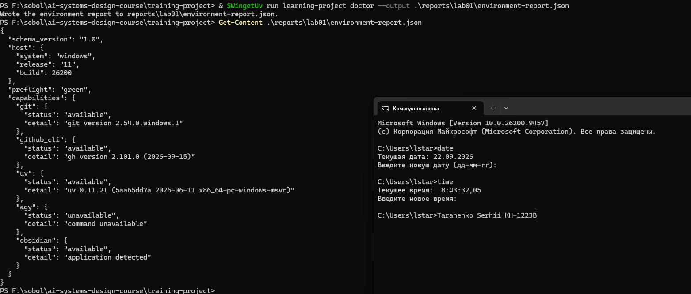
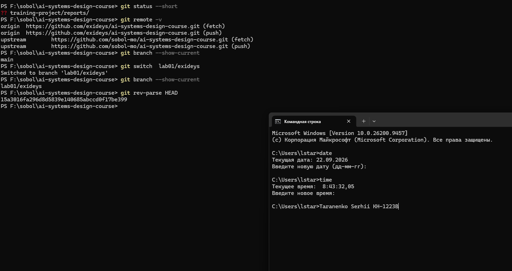
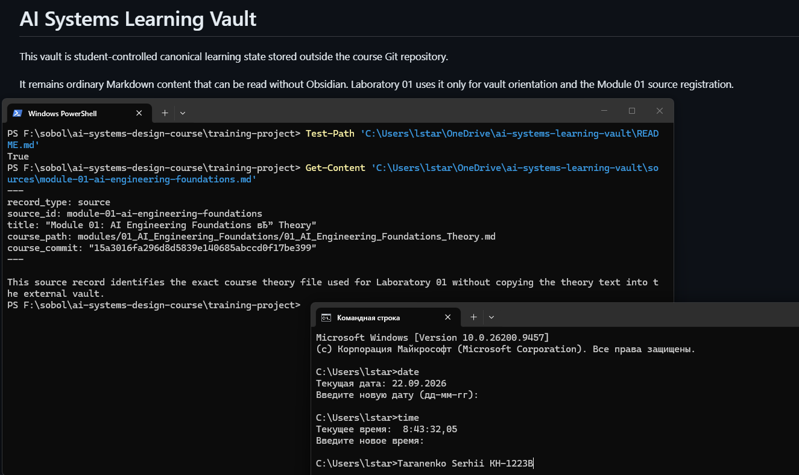
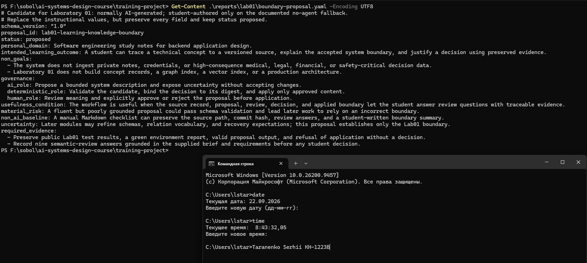
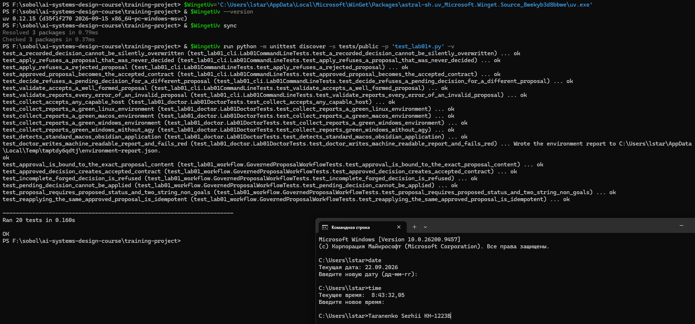
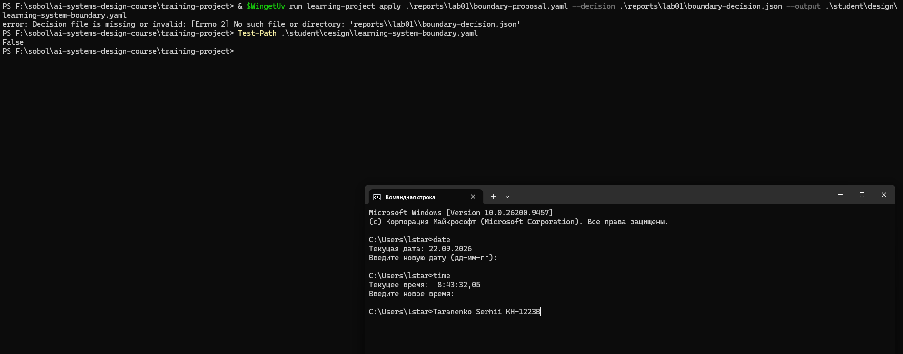
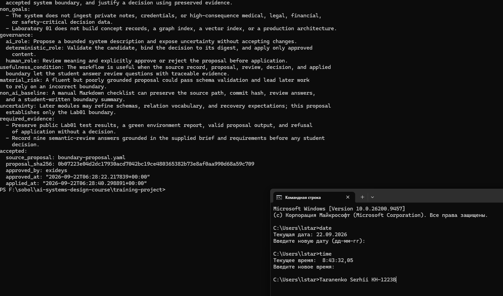

# Лабораторна робота 01

## Ідентифікація подання

- URL форку: https://github.com/exideys/ai-systems-design-course
- Назва гілки: `lab01/exideys`
- Повний хеш коміту: 02ae1a448f66b45ff5de64caf6885b3c5277547d.

## Середовище

Windows 11 build 26200, PowerShell 5.1, WinGet 1.29.290. У поточному клоні конфігурація називається `fixtures/windows/lab01-workstation-windows11.dsc.yaml`; в окремому завантаженому файлі лабораторної наведено стару назву. Обидва застосування завершилися успішно без видимого перевстановлення. Встановлені Git 2.54.0, GitHub CLI 2.101.0, WinGet-версія uv 0.12.15 та Obsidian 1.13.7. `doctor` повідомив зелений хост. У PATH також є uv 0.11.21, тому для лабораторних команд застосовано повний шлях до WinGet-версії. Вивід обох конфігурацій збережено у `provision.log`.

Рисунок — `02-workstation-capabilities.png`, звіт `doctor` про можливості робочої станції.

## Власність репозиторію

`origin` вказує на форк `exideys`, `upstream` — на `sobol-mo`. Локальна гілка `lab01/exideys` створена від `main`. У цій сесії коміту та push не виконано.

Рисунок — `01-git-remotes.png`, віддалені репозиторії та особиста гілка.

## Зовнішнє сховище Markdown-файлів

Сховище `C:\Users\lstar\OneDrive\ai-systems-learning-vault` є `external to repository`. Воно містить `README.md` і `sources/module-01-ai-engineering-foundations.md`. Джерело посилається на теорію модуля 01 у коміті `15a3016fa296d8d5839e140685abccd0f17be399`. OneDrive є початковим захистом поза пристроєм; студент має перевірити статус фактичної синхронізації.

Рисунок — `05-external-vault.png`, зовнішнє сховище та зареєстроване джерело.

## Шлях пропонувача

Antigravity CLI (`agy`) не знайдено у PATH. Як інший наявний агент використано Codex у цій сесії: на етапі пропозиції він прочитав контракти та змінив студентську копію `reports/lab01/boundary-proposal.yaml`. Пізніше Codex також підготував цей звіт та інструкцію за запитом студента; це не є свідченням суворого технічного обмеження прав агента. Прийняття кандидата агент не виконував. Потрібне справжнє очищене свідчення етапу пропозиції.

Рисунок — `04-proposer-session.png`, сеанс підготовки пропозиції.

## Семантичний розгляд

Нижче наведено підготовлені відповіді, які студент має перевірити та сформулювати власними словами. CLI зафіксував затвердження пропозиції на кроці 9; сам артефакт рішення не доводить, що кожне пояснення нижче було особисто відредаговане студентом.

1. Фіксована навчальна система знань збережена; `personal_domain` лише можливе подальше розширення. Попередній висновок: так.
2. Результат спостережуваний: простежити поняття до джерела, пояснити межу, обґрунтувати рішення. Попередній висновок: так.
3. Нецілі виключають приватні дані, рішення з високими наслідками та передчасну побудову індексів і архітектури. Попередній висновок: так.
4. ШІ пропонує, CLI перевіряє та застосовує лише затверджене, студент вирішує. Попередній висновок: так.
5. Корисність можна оцінити через джерело, пропозицію, розгляд, рішення й контракт. Попередній висновок: так.
6. Ризик правдоподібний: переконливий текст може пройти схему й закріпити хибну межу. Попередній висновок: так.
7. Ручний Markdown-чеклист є простішим і зберігає походження та рішення. Попередній висновок: так.
8. Свідчення охоплюють детерміновані тести та людський розгляд наданих контрактів. Попередній висновок: так.
9. Невизначеність конкретна: наступні модулі можуть уточнити схеми, відношення й відновлення. Попередній висновок: так.

Висновок у CLI: пропозицію `lab01-learning-knowledge-boundary` затверджено. Студенту потрібно підтвердити змістовний висновок у цьому тексті власними словами перед поданням.

## Розподіл повноважень

Агент складає кандидат, але не надає йому чинності. CLI перевіряє форму й відповідність рішення точному вмісту; семантичну якість оцінює студент. Студент виконав `decide --approve --by exideys`; рішення містить дайджест пропозиції `0b07223e04d2dc17930acd7042bc19ce480365382b73e8af0aa990d68a59c709` і час `2026-09-22T06:28:22.217839+00:00`. Після цього `apply` створив прийнятий контракт зі `status: approved`.

## Корисність і базова лінія без ШІ

Агент допомагає швидше знайти прогалини в обґрунтуванні. Без ШІ студент може вести ручний чеклист із шляхом джерела, хешем коміту, відповідями та підсумком межі. Корисність ШІ оцінюється за перевірюваними свідченнями.

## Особиста предметна сфера як пізніше розширення

Нотатки про проєктування backend-застосунків є прикладом пізнішого нечутливого розширення. Поточний результат стосується навчальної системи знань і походження технічних понять, а не окремого backend-продукту.

## Проєктний компроміс

Автоматичне складання кандидата економить час, але додає ризик переконливої помилки. Окремі валідація й людський розгляд потребують часу, зате стримують цей ризик.

## Детерміновані перевірки

`uv sync` завершився. Під час підготовки Codex окремо запустив повний набір публічних тестів: `Ran 76 tests`, `FAILED (failures=2, errors=26, skipped=1)` на Lab02, зокрема через невідповідність фрагмента джерела. Студент для цієї лабораторної запустив тести Lab01: `Ran 20 tests ... OK`, що видно на `03-public-tests.png`. Це не твердження про успіх усього набору тестів. `doctor` створив зелений `environment-report.json`, `validate` прийняв пропозицію, а передчасний `apply` відмовив через відсутнє рішення та не створив контракту. Пізніше студент виконав `decide --approve`; повторний `apply` створив `student/design/learning-system-boundary.yaml` зі `status: approved`. Успішна перевірка схеми не доводить змістовної правильності кандидата.

Рисунок — `03-public-tests.png`, 20 успішних тестів Lab01.

Рисунок — `06-premature-apply-refused.png`, відмова застосування до рішення.

Рисунок — `07-accepted-contract.png`, прийнятий контракт після рішення студента. Для остаточного подання знімок слід перезняти так, щоб було видно `status: approved`.

## Відновлення

Робочу станцію відтворюють WinGet-конфігурацією й `doctor`; проєктні артефакти — з майбутнього коміту особистої гілки. Зовнішнє сховище є змінним канонічним станом поза Git і відновлюється окремо через OneDrive за умови фактичної синхронізації. Небажані зміни можуть синхронізуватися, тому це лише початковий захист.
